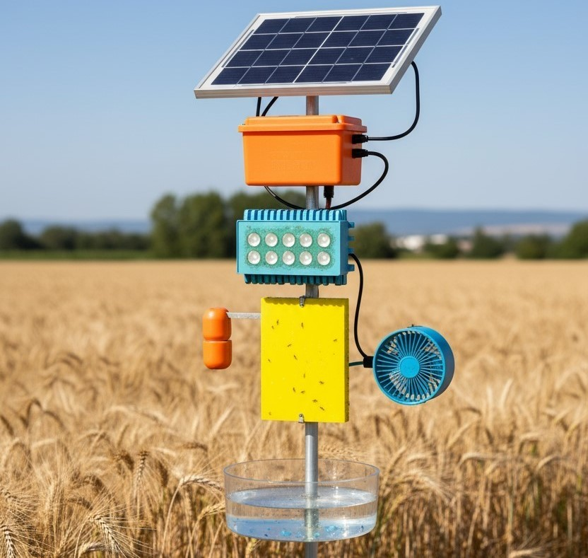

# 🌾 KisanSeva - Empowering Modern Agriculture with Innovation

> Bridging traditional farming wisdom with cutting-edge technology to help Indian farmers reduce pesticide use, increase yields, and embrace sustainable practices.

---

## 🚀 What is KisanSeva?

KisanSeva is a full-stack web platform built for Indian farmers that combines AI-powered pest diagnosis, smart crop planning, and eco-friendly pest control hardware - all in one place. It connects elder farmers' wisdom with youth innovation, and makes precision agriculture accessible to everyone.

---

## ✨ Features

| Feature | Description |
|---|---|
| 🔬 AI Pest Diagnosis | Upload a crop photo → instant pest/disease ID + treatment plan using TensorFlow.js MobileNet |
| 📅 Smart Crop Calendar | Region & season-aware planting schedules with MSP-based financial projections |
| 💰 ROI Calculator | Calculate savings from switching to solar-powered pest control vs. traditional pesticides |
| 🛒 Marketplace | Farmers can list and browse agri-products and equipment |
| 💬 Knowledge Exchange | Community forum connecting experienced farmers with newcomers |
| 🌍 Multilingual UI | English, Hindi (हिंदी), Punjabi (ਪੰਜਾਬੀ) and other regional languages support |
| ☀️ Solar Insect Trap | Our flagship hardware product - 100% chemical-free, solar-powered pest trap |

---

## 🧠 The Problem We're Solving

Indian farmers spend **₹8,000–₹15,000 per acre per year** on chemical pesticides that:
- Degrade soil health over time
- Create health risks for farmers and consumers
- Lead to pest resistance, requiring ever-stronger chemicals
- Contribute to environmental pollution

KisanSeva offers a smarter, greener path forward.

---

## 💡 Our Solution — Solar Insect Trap

A one-time investment solar-powered trap that:
- Attracts and eliminates harmful insects using UV light
- Requires **zero chemicals** and **zero electricity costs**
- Has a **5+ year lifespan**
- Pays back its cost in under **6 months** for an average 2-acre farm

---

## 📊 Projected Impact (at scale)

| Metric | Projection |
|---|---|
| Farmers Benefited | 28,000,000+ |
| Pesticide Cost Savings | ₹5 Crore+ |
| Crop Loss Reduction | Up to 85% |
| Generations Connected | 3+ |

---

## 🛠️ Tech Stack

| Layer | Technology |
|---|---|
| Backend | Python, Flask |
| Database | SQLite (via SQLAlchemy) |
| Frontend | HTML5, CSS3, Vanilla JS |
| AI/ML | TensorFlow.js, MobileNet (client-side inference) |
| Auth | Flask-Login, Werkzeug password hashing |
| Deployment | Flask dev server / any WSGI host |

---

## 🗂️ Project Structure

```
kisanseva/
├── app.py                  # Flask app — routes, models, auth
├── instance/
│   └── kisanseva.db        # SQLite database
├── static/
│   ├── style.css
│   ├── uploads/            # User-uploaded farm images
│   └── *.jpg               # Product & demo images
└── templates/
    ├── login_landing.html      # Landing page + hero
    ├── login_register.html     # Auth page
    ├── ai_pest_diagnosis.html  # AI diagnosis tool
    ├── crop_calendar.html      # Smart crop planner
    ├── roi_calculator.html     # Savings calculator
    └── product_details.html    # Solar trap product page
```

---

## ⚡ Getting Started

```bash
# 1. Clone the repo
git clone https://github.com/your-username/kisanseva.git
cd kisanseva

# 2. Install dependencies
pip install flask flask-sqlalchemy werkzeug

# 3. Run the app
python app.py
```

Then open `http://localhost:5000` in your browser.

---

## 🖼️ Screenshots

| Landing Page | AI Pest Diagnosis | ROI Calculator |
|---|---|---|
|  | Drag & drop crop photo → instant AI diagnosis | Enter farm size → see 5-year savings |

---

## 🌱 Roadmap

- [ ] WhatsApp / SMS alerts for pest outbreak warnings
- [ ] Weather API integration for smarter crop recommendations
- [ ] Mobile app (React Native)
- [ ] IoT integration with solar trap for real-time pest count data
- [ ] Government scheme eligibility checker

---

## 👥 Team

Built with ❤️ for farmers across India.

---
